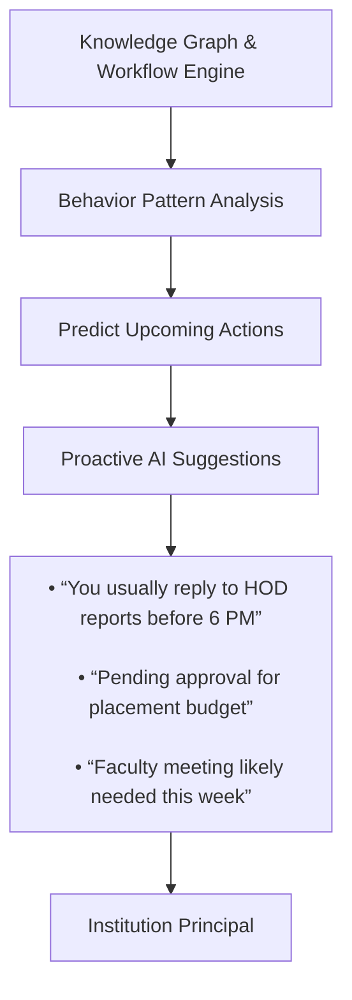
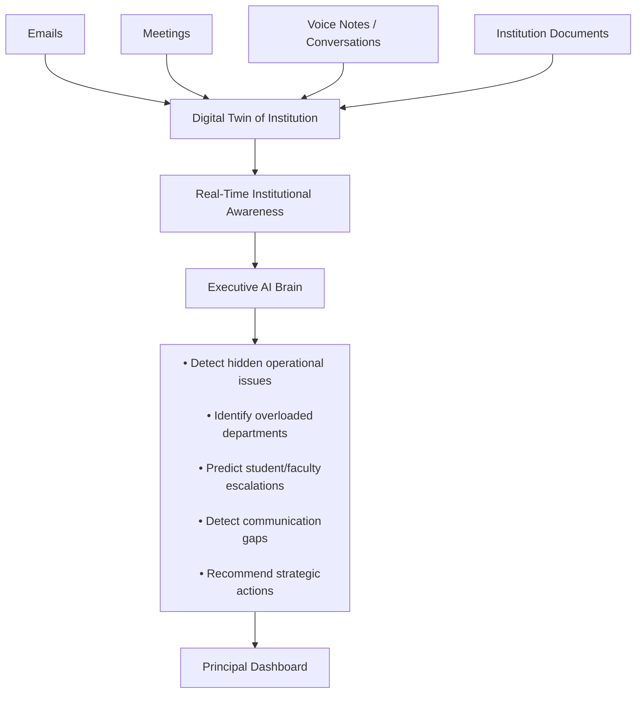
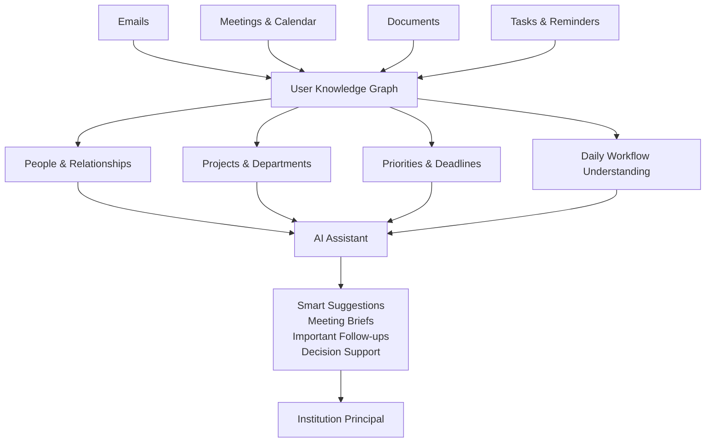

# About HELIOS

Project **HELIOS** is an *AI-powered executive assistant* designed for institutional leadership.  
It combines intelligent email management, natural language search, workflow understanding, and organizational intelligence into a single smart platform.  

The system learns from emails, meetings, documents, calendars, and tasks to build a deep understanding of the institution’s operations and communication flow.  
  
## Using advanced AI and knowledge graph technology, HELIOS can:  
  
- Answer questions in natural language  
- Find emails using contextual search  
- Track deadlines and priorities  
- Generate smart summaries and drafts  
- Detect operational bottlenecks  
- Provide executive insights and recommendations  
- Understand relationships between people, departments, and projects  
  
HELIOS acts as a digital chief-of-staff for institutional leaders, helping them make faster, smarter, and more informed decisions.

# Feature One

### Feature Idea: **Proactive Executive Intelligence**

Instead of waiting for commands, the assistant predicts:

- urgent approvals,
- delayed responses,
- important stakeholders,
- upcoming institutional risks,
- recurring workflows,
- and decision bottlenecks.

It acts like an AI Chief of Staff for the principal.

---
# Feature two

### Stunning Feature: **AI Digital Twin of the Institution**

The system continuously builds a live operational model of the institution by understanding:

- who communicates with whom,
- which departments are active or blocked,
- emerging issues,
- decision flow,
- academic and administrative pressure points.
#### Executive Command Center

The principal can interact with the institution using natural language:

- “Show pending approvals”
- “Which department has maximum workload?”
- “Summarize today’s important events”
- “Find all discussions about accreditation”
- “Which department is under the most stress this month?”
- “What issues are escalating silently?”
- “Who are the key coordinators keeping placements moving?”
- “What bottlenecks are affecting approvals?”

The AI becomes a conversational operating system for the institution.

# Feature three

### Knowledge Graph & Workflow Intelligence

The assistant continuously learns from:

- Emails
- Meetings & Calendar
- Documents
- Tasks & Reminders

It builds a **Knowledge Graph** to understand:

- Important people and relationships
- Departments and ongoing projects
- Priorities and deadlines
- Daily workflow patterns

Using this understanding, the AI can provide:

- Smart meeting summaries
- Important follow-up reminders
- Decision support for the principal
- Context-aware email drafting
- Priority-based task suggestions

The system acts like an intelligent executive assistant that deeply understands the institution’s workflow and operations.

# Feature four

Smart Personalised Email Drafting
![[Feat-5.svg]]