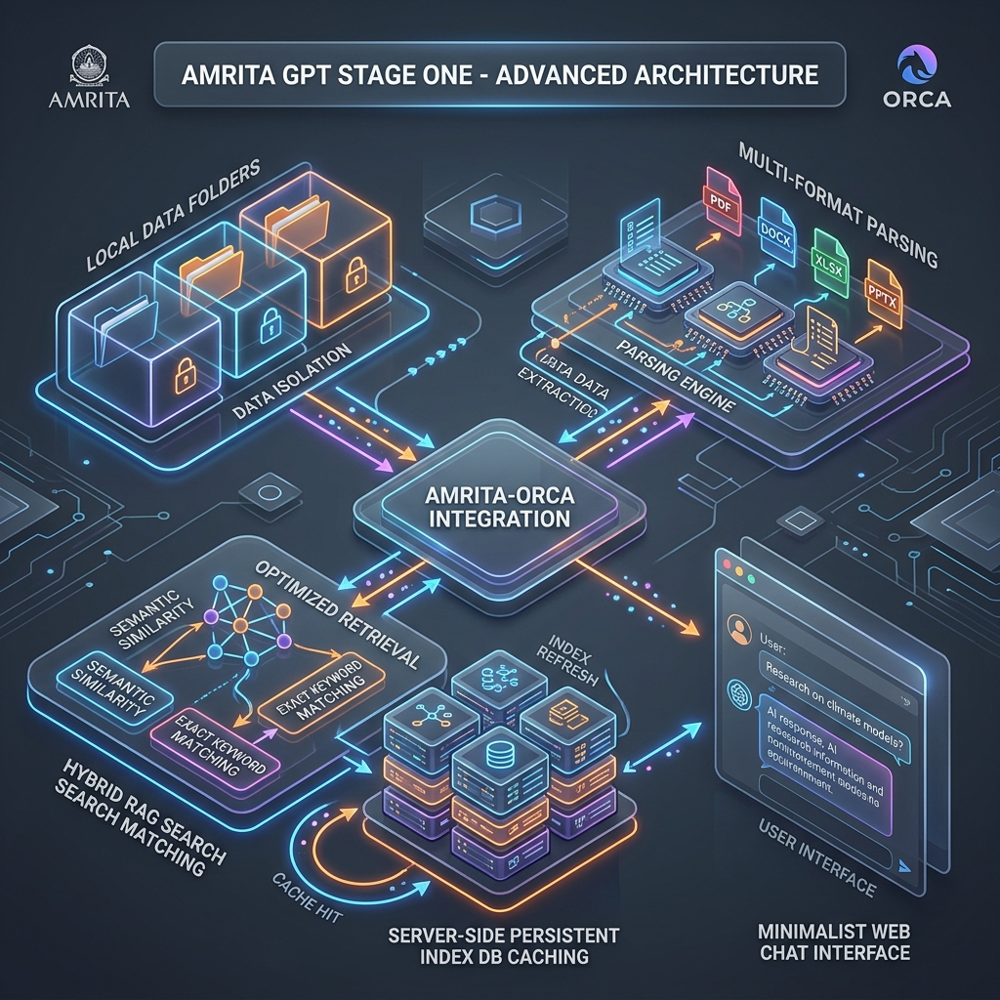

# Presentation: AmritaGPT Stage One Implementation

We have designed a highly professional **Stage One Architecture Infographic**, generated **4 Custom Explainer Storyboard Slides**, and compiled a **Complete Video Explainer & Pitch Script** to help the **Orca** startup present **AmritaGPT** to institutional stakeholders, administrators, and investors!

---

## 📽️ Interactive Explainer Storyboard Carousel

*Below is the sequential visual storyboard representing the key scenes of your AmritaGPT Stage One video pitch. Hover and click next to step through the scenes.*

|![[amritagpt_intro_slide_1779844738987.png]]     |![[amritagpt_ingest_slide_1779844759952.png]]     |
| --- | --- |
|  ![[amritagpt_search_slide_1779844786169.png]]   |![[amritagpt_cache_slide_1779844807524.png]]     |

---

## 📐 AmritaGPT Stage One Overall Architecture
*The deep structural database, parsing, and query flow backend:*

---

## 🎬 Video Explainer & Pitch Script
*Use this highly engaging storyboard and voiceover script to record your demo video or pitch the Stage One MVP to university officials.*

> **Target Duration**: 2 Minutes  
> **Speaker**: Student Co-founder, Orca Startup  
> **Backing Track**: Uplifting, minimalist electronic corporate beat (low volume)

---

### **Scene 1: Introduction (0:00 – 0:15)**
* **Visual on Screen**: 
  - (**Slide 1: Intro Scene**) Smooth camera panning down from a modern 3D render of the Amrita Chennai Campus gate to the glowing **AmritaGPT** chat screen. 
  - Pointers highlighting: *"Developed and Powered by Orca Startup"*.
* **Voiceover (VO)**: 
  > *"Welcome to the future of campus intelligence. This is AmritaGPT—the official, secured institutional AI assistant for Amrita Vishwa Vidyapeetham, Chennai Campus. Built from the ground up by Orca, an innovative student startup right here on our campus."*

---

### **Scene 2: Data Isolation & Multi-Format Ingestion (0:15 – 0:45)**
* **Visual on Screen**: 
  - (**Slide 2: Multi-Format Document Ingestion**) A glowing, lock-shield graphic showing the server-isolated `data/` folder block. 
  - Custom documents (.pdf, .docx, .xlsx, .pptx) smoothly drifting into the **"Orca Ingestion Engine"** card on the diagram.
  - Pointers showing: *pdf-parse, mammoth, xlsx, officeparser*.
* **Voiceover (VO)**: 
  > *"Stage One is all about absolute security and dynamic data integration. AmritaGPT operates inside an isolated, secure directory boundaries, with path-traversal blocks preventing unauthorized access. Our ingestion engines parse multi-format records—extracting text from PDFs, Word files, spreadsheets, and PowerPoint slide decks instantly."*

---

### **Scene 3: Semantic Hybrid Retrieval (0:45 – 1:15)**
* **Visual on Screen**: 
  - (**Slide 3: Hybrid Semantic Search & Path Boosting**) Close-up on the **"Optimized Retrieval"** box of the architecture diagram. 
  - Two parallel data tracks: one calculating TF-IDF term frequencies, and another fetching vector cosine similarities from Ollama embeddings.
  - A query *"What are Alice's achievements?"* triggers a glowing pulse that highlights folder `data/Alice/` and scores it with a `2.5x Path Boost`, leaving folder `data/Bob/` untouched.
* **Voiceover (VO)**: 
  > *"To answer questions accurately, we built a hybrid RAG retrieval pipeline. We generate high-dimensional vector embeddings locally and compute Cosine Similarity, fused with term frequency indices. Crucially, our path-string metadata filters apply real-time boosting. When you query records for a specific committee or individual, the context is locked onto their folder path—completely eliminating cross-contamination of achievements."*

---

### **Scene 4: Server-Side Persistence (1:15 – 1:45)**
* **Visual on Screen**: 
  - (**Slide 4: Server-Side Persistent Caching**) The database card **".orca_index.json"** on the diagram glowing.
  - A file-modified check graphic showing `mtime` matches instantly skipping indexing, showing a green *"Cache Hit - 100% Skip Ingestion & Parsing"* checkmark.
* **Voiceover (VO)**: 
  > *"Efficiency is key. Instead of re-parsing and re-generating heavy vector embeddings on every question or server reboot, AmritaGPT persists the parsed chunks and vectors on the server disk. Our modification tracking scans document timestamps in milliseconds. Unchanged files bypass calculations entirely—delivering near-instant queries while saving campus compute power."*

---

### **Scene 5: The Interface & Looking Ahead (1:45 – 2:00)**
* **Visual on Screen**: 
  - The clean, centered glassmorphic user interface showing a warm streaming answer by **AmritaGPT**, complete with line-number citations (e.g. `readme.txt:L15`).
  - Amrita & Orca logos side-by-side with a glowing tagline: *"Local RAG, Institutional Pride."*
* **Voiceover (VO)**: 
  > *"AmritaGPT synthesizes warm, human-like answers locally, complete with document citations, and handles missing files gracefully. This is Stage One—a robust, secure, and blazing-fast local RAG foundation. AmritaGPT, powered by Orca: shaping campus intelligence, one slide at a time."*
