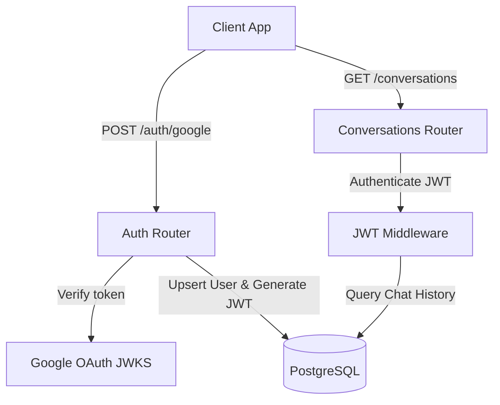

# Implementation Plan: Google OAuth 2.0, PostgreSQL & Chat Persistence Backend

  

Configure a secure, production-ready backend for **AmritaGPT** incorporating Google-only OAuth 2.0 authentication, PostgreSQL normalized storage, secure JWT sessions with hashed refresh tokens, and server-side cursor-paginated chat history persistence.

  

---

  

## User Review Required

  

> [!IMPORTANT]

> **Google OAuth Credentials Needed**: You will need to create a project in the Google Cloud Console, enable the Google OAuth 2.0 API, configure the consent screen, and obtain a `GOOGLE_CLIENT_ID` and `GOOGLE_CLIENT_SECRET`.

> **PostgreSQL Access Needed**: Ensure you have a running PostgreSQL instance (or supply the connection details of an external server). We will load these credentials from the `DATABASE_URL` environment variable.

> **Auto-Migration Enabled**: On server startup, our backend will automatically check for the existence of required tables (`users`, `refresh_tokens`, `conversations`, `messages`) and triggers. It will execute the exact SQL schema provided, meaning **no manual schema setup or psql CLI imports are required from your side**.

  

---

  

## Open Questions

  

> [!NOTE]

> **JWT Expiry Values**: We plan to set the access token expiry to `15 minutes` (signed using a secure HS256 algorithm via a 256-bit `JWT_SECRET` key loaded from `.env`) and the refresh token to `7 days`.

> **Soft vs Hard Delete**: For conversation deletion (`DELETE /conversations/:id`), we will support a hard delete (which triggers `ON DELETE CASCADE` across foreign keys, clearing the DB perfectly) or a soft-delete (setting `is_archived = true`). We will default to a soft-delete (archiving) or support a query parameter `?hard=true` for hard deletion.

  

---

  

## Proposed Changes

  

We will introduce a highly modular, secure structure inside `/Users/hirthikbalaji/Orca`:

  

  

### 1. Database & Migrations Layer

  

#### [NEW] [index.js](file:///Users/hirthikbalaji/Orca/db/index.js)

Handles the PostgreSQL connection pool utilizing the `pg` driver. Implements a self-healing auto-migration script running on server boot that checks, creates, and sets up:

- The `users` table with standard indexes.

- The `refresh_tokens` table with cryptographically hashed bcrypt values and indexes.

- The `conversations` and `messages` tables with indexes.

- The `update_updated_at` function and triggers to automate timestamp updates.

  

### 2. Authentication & Session Middleware

  

#### [NEW] [auth.js](file:///Users/hirthikbalaji/Orca/middlewares/auth.js)

Standard secure JWT authentication middleware:

- Verifies the `Authorization: Bearer <access_token>` header.

- Decodes the token, validating expiration (`exp`), issuer (`iss`), and audience (`aud`).

- Attaches the authorized `req.user` payload to the request object.

- Rejects non-authenticated access with a standard structured JSON error.

  

### 3. Route Handlers & Controllers

  

#### [NEW] [auth.js](file:///Users/hirthikbalaji/Orca/routes/auth.js)

Handles all Google OAuth and token exchange processes:

- `POST /auth/google`: Verifies the incoming Google `id_token` against Google OAuth keys. Extracts the Google `sub` (UID), name, email, and picture. Atomic upserts (`ON CONFLICT (google_id) DO UPDATE`) user inside the database, issues access and refresh tokens, hashes the refresh token using `bcryptjs`, and persists the hash to the DB.

- `POST /auth/refresh`: Swaps a valid, active refresh token for a fresh access token. Verifies the token signature, checks if the bcrypt-hash matches the stored hash in `refresh_tokens`, and verifies it is not revoked or expired.

- `POST /auth/logout`: Revokes and deletes the associated refresh token from the database.

- `GET /auth/me`: Returns the authenticated user's profile.

  

#### [NEW] [conversations.js](file:///Users/hirthikbalaji/Orca/routes/conversations.js)

Handles persistent chat history operations with full cursor-based pagination to prevent performance degradation:

- `GET /conversations`: Lists conversations for the current user (cursor-paginated using `before=<conversation_id>` and `limit`).

- `POST /conversations`: Creates a new conversation thread.

- `GET /conversations/:id`: Fetches the conversation details and full message history.

- `PATCH /conversations/:id`: Updates a conversation's title or archived status.

- `DELETE /conversations/:id`: Soft deletes (archives) or hard deletes the thread.

- `POST /conversations/:id/messages`: Appends user or assistant messages.

- `GET /conversations/:id/messages`: Paginated message list.

  

### 4. Configuration & Server Integration

  

#### [MODIFY] [server.js](file:///Users/hirthikbalaji/Orca/server.js)

Integrates all new features:

- Installs secure CORS policies binding incoming connections to `FRONTEND_URL` in production.

- Configures `express-rate-limit` on the `/auth/google` route to prevent brute-force abuse (10 req/min per IP).

- Loads configurations strictly from environment variables using `dotenv`.

- Plugs the auth middleware into `/api/chat` to protect the semantic RAG endpoint.

  

#### [NEW] [.env.example](file:///Users/hirthikbalaji/Orca/.env.example)

Provides a clean configuration template with instructions on required credentials:

- `GOOGLE_CLIENT_ID` & `GOOGLE_CLIENT_SECRET`

- `JWT_SECRET`

- `DATABASE_URL`

- `FRONTEND_URL` & `NODE_ENV`

  

#### [MODIFY] [package.json](file:///Users/hirthikbalaji/Orca/package.json)

Installs:

- `pg` (PostgreSQL driver)

- `google-auth-library` (Google token verification)

- `jsonwebtoken` (JWT creation/verification)

- `bcryptjs` (Refresh token hashing)

- `express-rate-limit` (Auth rate limiting)

- `dotenv` (Environment variable management)

  

---

  

## Verification Plan

  

### Automated Database Tests

- Create a test script `/Users/hirthikbalaji/Orca/scratch/test_db_migration.js` to execute the database connection, verify auto-migration creates the schema, tests trigger execution, and measures execution performance.

  

### Endpoint Verification

- Write a mock API test suite using `curl` or a test JS script to programmatically:

1. Trigger token refreshes.

2. Verify JWT middleware blocks unauthenticated requests.

3. Validate cursor-based pagination is executed correctly.

4. Perform login, query lists, message appends, and logout.