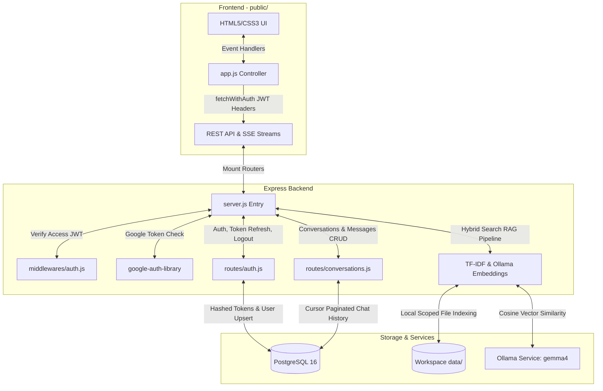
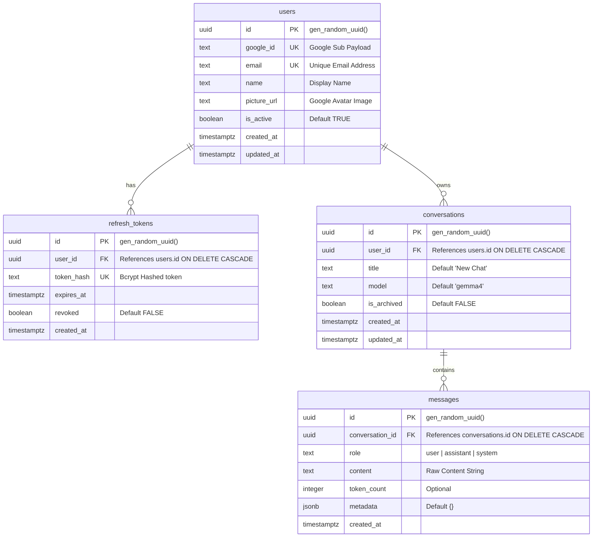
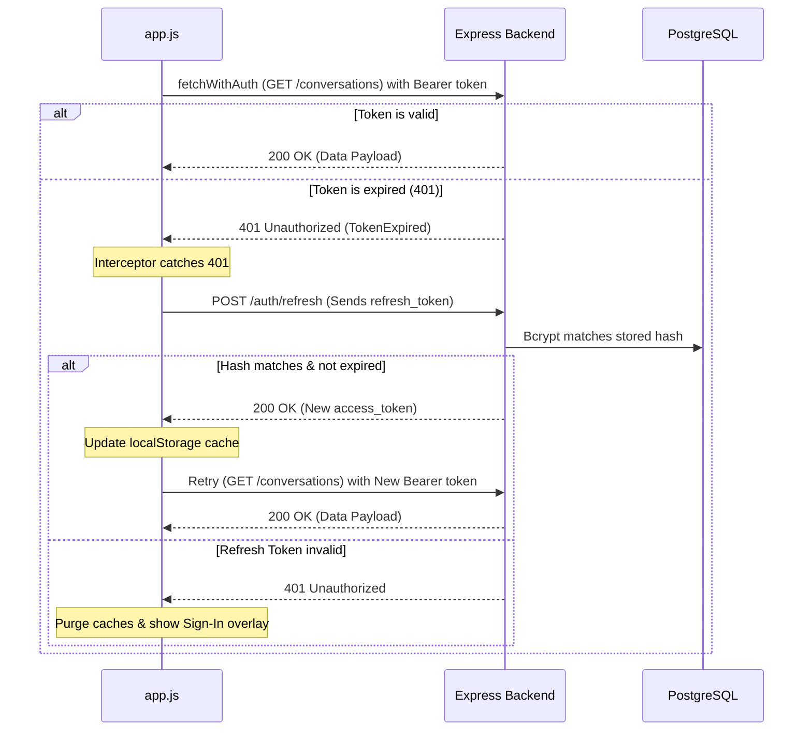

# Technical Documentation: AmritaGPT Architecture & Low-Level Codebase Report

  

Welcome to the low-level developer documentation for **[[AmritaGPT]]** — the secure, private institutional AI intelligence assistant powered by a local hybrid RAG engine, Google OAuth 2.0 verification, and persistent PostgreSQL storage.

  

---

  

## 🏛️ 1. Architectural System Design

  

AmritaGPT is structured as a robust 3-tier application:

  



  

---

  

## 📂 2. File & Directory Layout

  

```
├── server.js # Express application entry, server-sent events (SSE) & RAG engine

├── db/

│ └── index.js # PostgreSQL pool configuration and self-healing DB auto-migrations

├── middlewares/

│ └── auth.js # Cryptographic JWT access token authorization verification middleware

├── routes/

│ ├── auth.js # Google OAuth verify, bcrypt token hashes, rotation & profiles

│ └── conversations.js # Paginated conversations, soft/hard deletes, message persistence

├── public/

│ ├── index.html # Google GSI scripts, login overlay cards, sidebar layout, Marked.js

│ ├── style.css # HSL scholarly variables, serif reading scale, GFM list/table styles

│ └── app.js # Token rotator interceptor, history loaders, auto-grow text, streaming

├── data/ # Isolated local directory for scoped institutional file ingestion

├── .env # System secrets (Google Client ID/Secret, JWT secret, Database connection)

├── .env.example # Environment configurations template

├── package.json # Node.js project manifests & dependency locks

└── .orca_index.json # Persistent local JSON vector database cache for RAG embeddings

```

  

---

  

## 🗄️ 3. Database Schema & Auto-Migrations (`db/index.js`)

  

The `db/index.js` module establishes connection pooling using the `pg.Pool` class. On startup, the server automatically boots an atomic transaction verifying and creating the following normalized database structure:

  

### 3.1 Entity Relationship Diagram

  



  

### 3.2 Automated PL/pgSQL Row Triggers

To automate timestamp synchronization, `db/index.js` defines a stored function that automatically updates the `updated_at` column to `NOW()` upon modifications.

```sql

CREATE OR REPLACE FUNCTION update_updated_at()

RETURNS TRIGGER AS $$

BEGIN

NEW.updated_at = NOW();

RETURN NEW;

END;

$$ LANGUAGE plpgsql;

  

CREATE TRIGGER trg_users_updated_at BEFORE UPDATE ON users FOR EACH ROW EXECUTE FUNCTION update_updated_at();

CREATE TRIGGER trg_conversations_updated_at BEFORE UPDATE ON conversations FOR EACH ROW EXECUTE FUNCTION update_updated_at();

```

  

---

  

## 🔒 4. Security & JWT Validation Middleware (`middlewares/auth.js`)

  

Protects sensitive CRUD persistence and RAG endpoints using standard JWT validation rules:

* **Function: `requireAuth(req, res, next)`**

* Extracts the raw token from the `Authorization: Bearer <access_token>` request header.

* Uses `jwt.verify()` with your environment-specific `JWT_SECRET` to cryptographically assert signature validity.

* Enforces claims check:

* **`iss` (Issuer)**: Must exactly match `'amritagpt-auth'`.

* **`aud` (Audience)**: Must exactly match `'amritagpt-client'`.

* If validation succeeds, extracts user metadata (`id`, `email`, `name`) and binds it to `req.user`, calling `next()`.

* If validation fails (expired or modified), returns a structured JSON block (e.g. `{ error: "TokenExpired", message: "..." }`) and blocks route execution.

  

---

  

## 🔑 5. Authentication & OAuth Rotator Router (`routes/auth.js`)

  

Manages the Google OAuth 2.0 flow, session cookies, bcrypt cryptography, and token exchanges:

  

### 5.1 Function: `verifyGoogleToken(idToken)`

* **Module**: Uses Google's official `OAuth2Client.verifyIdToken`.

* **Logic**: Decodes `id_token` and validates it against Google's public JWKS certificates. Asserts that the client claim matches the server's registered `GOOGLE_CLIENT_ID` inside `.env`.

* **Returns**: Decoded payload containing the unique Google Subject ID (`sub`), user email, name, and profile avatar picture.

  

### 5.2 Function: `generateTokens(user)`

* **Logic**: Signs two unique cryptographic payloads:

1. **Access Token**: Short-lived (default 15m), signed HS256, carrying user parameters.

2. **Refresh Token**: Long-lived (default 7d), carrying `{ id: user.id, type: 'refresh' }`.

  

### 5.3 Route: `POST /auth/google`

* **Flow**:

1. Validates the client's `id_token` against the Google JWKS endpoint.

2. Runs an atomic upsert statement:

```sql

INSERT INTO users (google_id, email, name, picture_url) VALUES ($1, $2, $3, $4)

ON CONFLICT (google_id) DO UPDATE SET email = EXCLUDED.email, name = EXCLUDED.name, picture_url = EXCLUDED.picture_url, updated_at = NOW()

RETURNING *;

```

3. If user `is_active` is FALSE, blocks access.

4. Generates both Access and Refresh JWTs.

5. Hashes the Refresh Token using `bcryptjs` (10 salt rounds) and stores the hash inside the `refresh_tokens` database table.

6. Returns `{ access_token, refresh_token, user }`.

  

### 5.4 Route: `POST /auth/refresh`

* **Flow**:

1. Decodes and verifies the refresh token signature.

2. Queries active, unrevoked hashes from the `refresh_tokens` table for the target `user_id`.

3. Performs timing-safe comparison utilizing `bcrypt.compare` to match the incoming token.

4. If a match is found, signs a new 15-minute Access Token and returns it.

  

### 5.5 Route: `POST /auth/logout`

* **Flow**: Decodes the refresh token, performs the bcrypt-hash lookup, and permanently deletes/invalidates the corresponding refresh token from the database, securing the session closing.

  

---

  

## 💬 6. Chat History & Persistence Router (`routes/conversations.js`)

  

Manages the server-side persistent conversation storage with high-performance cursor pagination:

  

### 6.1 Cursor-Based Pagination Logic (`GET /conversations`)

Rather than utilizing slow offsets (`LIMIT/OFFSET`), conversations are indexed by `updated_at DESC`. When retrieving lists:

1. If a `before` cursor is supplied, queries the database for the exact `updated_at` time of that conversation ID.

2. Selects items updated strictly *before* that timestamp:

```sql

SELECT * FROM conversations WHERE user_id = $1 AND is_archived = FALSE AND updated_at < $2 ORDER BY updated_at DESC LIMIT $3

```

3. Checks if `rows.length > limit` to assert `has_more` status, returning the data array alongside the `next_cursor` UUID.

  

### 6.2 Messages Append Loop (`POST /conversations/:id/messages`)

* Inserts a user or assistant message to the `messages` table.

* Touches the parent conversation `UPDATE conversations SET updated_at = NOW() WHERE id = $1` to keep recent conversations float-sorted inside the sidebar dynamically.

  

---

  

## 🧠 7. Path-Boosted Hybrid RAG Search Engine (`server.js`)

  

Implements a secure, zero-dependency Hybrid Search RAG pipeline running completely inside the Node.js backend.

  

### 7.1 File Ingestion & Parsing (`parseFileToText`)

Reads directories recursively on boot (ignoring system folders) and indexes documents by parsing contents:

* **PDFs (`pdf-parse`)**: Converts files into Node memory buffers. Instantiates `pdf.PDFParse` dynamically and converts standard Buffers to `Uint8Array` to cleanly serialize text.

* **Word Documents (`mammoth`)**: Extracts raw text blocks using structural body extractors.

* **Excel Sheets (`xlsx`)**: Reads workbooks and compiles tabular CSV layouts sheet-by-sheet under designated headers (`--- Sheet: Sheet1 ---`).

* **PowerPoints (`officeparser`)**: Utilizes `officeParser.parseOffice()` and converts structural XML slide decks into unified text blocks via `.toText()`.

* **Text / Fallbacks**: Fallback ASCII ASCII-character extractors handle `.doc` legacy files, and UTF-8 string decoders read plain text `.txt`, `.md`, and source files.

  

### 7.2 The Hybrid Scoring Formula

When a user asks a query, the search engine computes two scores for all file chunks:

1. **Keyword Score (TF-IDF - 30% Weight)**: Measures term frequency against inverse document frequency within chunks, filtering common stopwords.

2. **Semantic Vector Similarity (Ollama - 70% Weight)**: Queries the local Ollama service to obtain a 4096-dimensional embedding vector for the prompt, calculating the Cosine Similarity against cached document chunk vectors.

  

$$Score_{Combined} = 0.3 \times Score_{TF-IDF} + 0.7 \times Score_{Cosine}$$

  

### 7.3 Path-Based Entity Boost Filter

To isolate Alice's records from Bob's and prevent data leakage, the engine matches query tokens against relative file paths:

* If query words exist in a chunk's file path string, the chunk receives an automatic **`1.5x` score boost multiplier**.

* Boosted scored chunks are sorted descending, and the **top 4 matching paragraphs** are compiled into the LLM attention buffer as context.

  

---

  

## 🌐 8. Client-Side Authentication & Persistent UI (`public/app.js`)

  

Manages browser-side Identity services, local storage caches, and token rotations:

  

### 8.1 Custom fetchWithAuth Request Interceptor

To eliminate manual token additions and prevent session timeouts, the frontend passes all REST calls through a custom wrapper:

  



  

### 8.2 Collapsible Sidebar & Chat Auto-Renamer

* **Collapsible States**: Handles click triggers on `.sidebar-toggle-trigger`, adding/removing the `.collapsed` transition classes to hide the Recent Chats drawer without breaking alignment.

* **Auto-Renamer**: In `sendMessage()`, once Ollama completes streaming, checks if the active conversation title is `"New Chat"`. If yes, takes the first 30 characters of the user prompt and silently triggers `PATCH /conversations/:id` to rename the sidebar card dynamically!