# Comparative Analysis: EASA AI Concept Paper (Issue 02 vs. Proposed Issue 03)

  

This document provides a detailed, section-by-section comparative analysis of the European Union Aviation Safety Agency (EASA) Concept Papers:

1. **Issue 02**: *Guidance for Level 1 and 2 Machine Learning Applications* (April 2023 / early 2024, 285 pages)

2. **Proposed Issue 03**: *Guidance for Safety-Related Artificial Intelligence Applications* (June 2026, 239 pages)

  

---

  

## 1. High-Level Comparison & Scope Evolution

  

The transition from Issue 02 to Proposed Issue 03 represents a major expansion of technical scope, regulatory alignment, and operational automation levels.

  

| Dimension                | Issue 02                                                                                                                                                 | Proposed Issue 03                                                                                                                                                                                 |
| :----------------------- | :------------------------------------------------------------------------------------------------------------------------------------------------------- | :------------------------------------------------------------------------------------------------------------------------------------------------------------------------------------------------ |
| **Document Title**       | *Guidance for Level 1 and 2 machine learning applications*                                                                                               | *Guidance for safety-related artificial intelligence applications*                                                                                                                                |
| **Page Count**           | 285 pages                                                                                                                                                | 239 pages (more condensed, streamlined use cases)                                                                                                                                                 |
| **Total Objectives**     | **182 objectives**                                                                                                                                       | **326 objectives** (79% increase)                                                                                                                                                                 |
| **AI Technology Scope**  | Strictly data-driven Machine Learning (Supervised/Unsupervised)                                                                                          | **All AI Techniques**: Machine Learning (including **Reinforcement Learning**), **Logic- and Knowledge-Based (LKB)** symbolic AI, **Hybrid AI** (ML + LKB), and **Generative AI / LLMs**.         |
| **Automation Levels**    | **Levels 1 & 2**: • Level 1: Human assistance (1A: augmentation, 1B: support) • Level 2: Human-AI cooperation (2A: cooperation, 2B: collaboration) | **Levels 0 to 3**: • Adds **Level 0** (low automation, no direct human interaction, no link to decision-making) • Adds **Level 3** (advanced automation: 3A safeguarded, 3B non-supervised) |
| **Regulatory Alignment** | General aviation standards (ED-79A/ARP4754A, DO-178C/ED-12C)                                                                                             | Explicit alignment with the **EU AI Act (Regulation (EU) 2024/1689)**, specifically Article 108 and Article 14 (human oversight).                                                                 |
| **Focus of Guidelines**  | Product-embedded ML components                                                                                                                           | Product-embedded AI + **AI-based operational tools used by approved organisations**                                                                                                               |

  

---

  

## 2. Section-by-Section Structural Differences

  

### A. Foreword

* **Issue 02**: Outlines the initial milestones of the EASA AI Roadmap and the establishment of Rulemaking Task RMT.0742.

* **Proposed Issue 03**: Updated to reflect **EASA AI Roadmap 2.0 Phase II** ("AI/ML framework consolidation"). It introduces a critical alignment with the **EU AI Act (2024)**, pointing out that **Article 108** mandates EASA to integrate AI Act Chapter III (Section 2) requirements for high-risk AI systems into aviation implementing rules.

  

### B. Introduction

* **Technical Scope & Statement of Issue (B.1)**:

- *Issue 02*: Limited to data-driven Machine Learning.

- *Issue 03*: Rewritten to introduce a dual-axis taxonomy: **Data-driven AI (ML)** and **Symbolic AI (LKB)**. It details specific challenges of **Reinforcement Learning** (reward corruption), **LKB** (combinatorial complexity, knowledge representation), and **Generative AI/LLMs** (hallucinations, emergent behavior).

* **AI Trustworthiness Framework (B.2)**:

- Both issues utilize EASA's 4 building blocks (Trustworthiness analysis, AI assurance, Human-centred design, Safety risk mitigation). Proposed Issue 03 explicitly states that this framework is fully applicable to symbolic and hybrid AI, rather than just ML.

* **Criticality of AI Applications (B.3) & Classification (B.4)**:

- Section order swapped (Criticality is B.3 and Classification is B.4 in Issue 03).

- *Issue 03* adds **Level 0** (low automation) and **Level 3** (advanced automation). It introduces the concept of a **responsibility scheme assessment** for Level 2B and Level 3 systems due to the transfer of authority from human to system.

* **Novel Concepts Developed (B.5 in Issue 03 vs. B.6 in Issue 02)**:

Proposed Issue 03 expands the list of novel concepts to **ten distinct areas**:

1. *AI Assurance*: Split into *Learning Assurance* and *LKB Assurance*, and introduces limitations for using Off-The-Shelf (OTS) models (like LLMs).

2. *OD vs. ODD*: Establishes the Operational Design Domain (ODD) at the AI constituent level as a refinement of the Operational Domain (OD) at the system level.

3. *W-shape Process & AI Constituent*: Formalizes the **W-shape process** (V-shape for data/scenario/knowledge management, and V-shape for implementation) and defines the **AI constituent** as a flexible architectural layer between system and items.

4. *AI Explainability*: Separates explainability into **Development explainability** (post-ops/verification, under AI assurance) and **Operational explainability** (for the operator, under human-centred design).

5. *Human-AI Interaction*: Formally distinguishes **Cooperation (Level 2A)** (directive, no shared situation awareness) from **Collaboration/Teaming (Level 2B/HAT)** (co-constructive, shared situation awareness).

6. *Remote Oversight*: Introduced for Level 3A (safeguarded advanced automation) to align with EU AI Act Article 14.

7. *Delegated Oversight*: Introduced for Level 3B (non-supervised advanced automation). Defines the concept of an independent, automated **Operational Oversight System (OOS)**.

8. *Net Safety Benefit Concept*: Extends the concept of granting safety credits (e.g., a **1-level reduction in DAL/SWAL/AL**) for AI systems providing operational safety benefits. Limits reduction to DAL D/SWAL 4, and bans reductions for direct catastrophic failure conditions.

9. *Service Experience & Legacy AI*: Introduces **shadow operations** to gather in-service data to ease compliance.

10. *Approval for Approved Organisations*: Introduces a risk-based filter for AI-based tools used by approved organizations (not just embedded in products).

  

---

  

### C. AI Trustworthiness Guidelines

  

This is the core technical chapter of both papers. The structural modifications and additions are extensive.

```mermaid

graph TD

subgraph Issue 02 Structure

C2_2[C.2.2 Safety Assessment of ML]

C2_3_IS[C.2.3 Info Sec for ML]

C2_4_ET[C.2.4 Ethics HLEG 7 Gears]

C3_1_LA[C.3.1 Learning Assurance Supervised/Unsupervised]

C3_2_EXP[C.3.2 Dev & Post-ops Explainability]

C4_HF[C.4 Human Factors for AI]

C5_SRM[C.5 AI Safety Risk Mitigation Concept]

C6_ORG[C.6 Organisations & DOA case]

end

  

subgraph Issue 03 Structure

C2_2_NEW[C.2.2 Safety/Risk Assessment of AI-based Systems]

C2_3_ISM[C.2.3 In-Service Monitoring - NEW]

C2_4_IS_NEW[C.2.4 Info Sec for AI]

C2_5_ET_NEW[C.2.5 Ethics Checklist & Mitigation]

C3_1_NEW[C.3.1 AI Assurance Concepts - NEW]

C3_2_GEN[C.3.2 Generic Objectives - NEW]

C3_3_SU[C.3.3 Learning Assurance Supervised/Unsupervised]

C3_4_RL[C.3.4 Reinforcement Learning Assurance - NEW]

C3_5_LKB[C.3.5 LKB Assurance - NEW]

C3_6_INT[C.3.6 Integral Processes & Dev Explainability]

C3_7_REU[C.3.7 Reuse Expanded]

C3_8_HYB[C.3.8 Hybrid AI Assurance - NEW]

C4_HCD[C.4 Human-Centred Design flight deck/ATM contexts]

C4_8_RO[C.4.8 Remote Oversight Level 3A - NEW]

C5_AA[C.5 Safety Risk Mitigation in Advanced Automation Level 3]

C6_ORG_NEW[C.6 Organisations high-level MOC]

end

  

C2_2 --> C2_2_NEW

C2_2 --> C2_3_ISM

C2_3_IS --> C2_4_IS_NEW

C2_4_ET --> C2_5_ET_NEW

C3_1_LA --> C3_3_SU

C3_1_LA --> C3_7_REU

C3_2_EXP --> C3_6_INT

C4_HF --> C4_HCD

C4_HF --> C4_8_RO

C5_SRM --> C5_AA

C6_ORG --> C6_ORG_NEW

```

  

  

#### C.1 Purpose and Applicability

* **Issue 02**: Simple statement of applicability.

* **Proposed Issue 03**: Adds a critical table (**Table 2: Assurance level limitations by AI technology**):

- **Supervised Learning**: Up to IDAL C, AL 3 / SWAL 2.

- **Unsupervised Learning**: Up to IDAL D, AL 5 / SWAL 4.

- **Reinforcement Learning**: Up to IDAL C, AL 3 / SWAL 2.

- **Logic- & Knowledge-Based**: Up to IDAL C, AL 3 / SWAL 2.

- **Large OTS Models (e.g., LLMs)**: Up to IDAL D, AL 5 / SWAL 4.

- *Note*: Bans taking credit from architecture for independent AI constituents unless adapted.

  

#### C.2 Trustworthiness Analysis

* **C.2.1 Characterisation of the AI Application**:

- *Issue 02*: Subdivided into High-level tasks, ConOps, Functional analysis, and Classification.

- *Issue 03*: Simplified into 2.1.1 (High-level tasks), 2.1.2 (Usage domain - replacing ConOps/functional analysis), and 2.1.3 (Classification). Uses **CH** and **CL** prefixes.

* **C.2.2 Safety Assessment**:

- *Issue 02*: Under "Safety assessment of ML applications", divided into safety concepts, impact assessment, and initial/continuous safety assessment.

- *Issue 03*: Under "Safety (support)/risk assessment of AI-based systems", it divides into **Safety assessment for approved AI-based systems (C.2.2.1)** and **Risk assessment for AI-based systems used by approved organisations (C.2.2.2)**. The latter is a brand-new risk assessment framework utilizing **RA** prefixes.

* **C.2.3 In-Service Monitoring (NEW)**:

- *Issue 02*: Handled briefly under C.2.2.4 "Continuous safety assessment".

- *Issue 03*: Promoted to a standalone section **C.2.3: In-service monitoring to support continued risk assessment** with dedicated **CRA** (Continuous Risk Assessment) objectives (CRA-01 to CRA-03) focusing on safety margin erosion evaluation.

* **C.2.4 Information Security**:

- *Issue 02*: C.2.3 Information security for ML applications.

- *Issue 03*: C.2.4 Information security for AI applications. Generalizes risks beyond ML (e.g., knowledge base manipulation, reinforcement learning reward corruption). Uses **IS** objectives.

* **C.2.5 Ethics-Based Assessment**:

- *Issue 02*: Highly detailed walkthrough of the HLEG 7 Gears with embedded checklists (integrated with Annex 5).

- *Issue 03*: Completely streamlined. Replaces the 7 individual sections with a two-step process: (1) Preliminary ethics-based assessment checklist (checks for unfair bias, human autonomy, emotional influence, professional threats, GDPR compliance, environmental impact) and (2) Mitigation of identified ethics-based risks. Uses **ET** objectives.

  

#### C.3 AI Assurance

This section was completely reorganized in Issue 03.

* **C.3.1 AI Assurance Concepts (NEW)**:

- Establishes definitions and paradigms for *Learning assurance* (supervised/unsupervised vs. reinforcement learning), *LKB assurance*, and *Hybrid AI assurance*.

* **C.3.2 AI Assurance Generic Objectives (NEW)**:

- Deals with Requirements and Architecture Management for the AI constituent. Uses the **SURK-DA** prefix group.

* **C.3.3 Learning Assurance for Supervised/Unsupervised Learning**:

- Maps to the main body of C.3.1 in Issue 02. Restructured into Data Management (**SU-DM**), Learning Process Management (**SU-LM**), Model Training/Validation, and Implementation (**SU-IMP**).

* **C.3.4 Learning Assurance for Reinforcement Learning (NEW)**:

- Brand-new section defining objectives for Reinforcement Learning. Focuses on MDP core elements (Agent, Environment, Interface, Simulator) using the **R-MDP** prefix, Scenario management using **R-SC**, Learning process management using **R-LM**, and Implementation using **R-IMP**.

* **C.3.5 Logic- and Knowledge-Based AI Assurance (NEW)**:

- Brand-new section for LKB symbolic AI. Covers logic/knowledge management (**K-LKB** prefix) and Reasoning engine design/verification.

* **C.3.6 AI Assurance Integral Processes**:

- Contains integration and verification, config management (**SURK-CM**), and QA (**SURK-QA**).

- *Note*: **Development and post-operation explainability** (which was its own section C.3.2 in Issue 02) is now integrated here under **C.3.6.2 (Verification of Verification)** using the **SURK-EXP** prefix.

* **C.3.7 Reuse Considerations**:

- Significantly expanded from the brief subsection in Issue 02 to cover OTS models, previously developed models, transfer learning, LKB models, and legacy AI-based systems. Uses **RU** objectives.

* **C.3.8 Hybrid AI Assurance (NEW)**:

- Brand-new section for combining ML and LKB models.

  

#### C.4 Human-Centred Design Considerations for AI-Based Systems

* **Title Change**: Replaces "Human factors for AI" in Issue 02.

* **Context & Concepts (C.4.1 & C.4.2) (NEW)**:

- Adds context regarding flight deck and ATM domain regulatory frameworks.

* **AI Operational Explainability (C.4.3)**:

- Restructured to use **EXP** objectives focusing on end-user operational needs.

* **Interaction & Interface (C.4.4)**:

- Focuses on spoken procedural and natural language, and multi-modal interaction. Standalone section on *gesture language* from Issue 02 is integrated/removed. Uses **MI** objectives.

* **Human-AI Cooperation & Collaboration (C.4.5 & C.4.6)**:

- Replaces "Human-AI Teaming" in Issue 02. Formally splits the guidance into Cooperation (Level 2A, directive, cross-check validation using **CVO** objectives) and Collaboration/Teaming (Level 2B/HAT, shared situation awareness using **DCO** objectives).

* **Error Management (C.4.7)**:

- Restructured using **EM** objectives (minimizing design-related and operation-related errors).

* **Safeguarded Advanced Automation and Remote Oversight (C.4.8) (NEW)**:

- Brand-new section for Level 3A AI applications. Deals with information transfer upon alerting using **RO** (Remote Oversight) objectives.

  

#### C.5 Safety Risk Mitigation in Advanced Automation

* **Title Change**: Replaces "AI safety risk mitigation" in Issue 02.

* **Scope Expansion**:

- *Issue 02* was a tiny 1-page section with a single objective (SRM-01).

- *Issue 03* is a fully-fledged safety mitigation framework for Level 3 advanced automation, introducing:

- **C.5.1 Situation Representation (Level 3)**: Uses **SR** objectives.

- **C.5.2 Delegated Human Oversight (Level 3)**: Uses **DHO** objectives (defining the independent *Operational Oversight System*).

- **C.5.3 Responsibility Scheme Assessment (Level 2B & Level 3)**: Uses **RS** objectives to assess the allocation of authority, access, and capability.

  

#### C.6 Organisations

* **Issue 02**: C.6.1 (High-level provisions and AMC), C.6.2 (Competence), C.6.3 (Design organisation case).

* **Issue 03**: C.6.1 (High-level provisions and MOC), C.6.2 (Competence). DOA-specific processes are merged into the general text, and "AMC" (Acceptable Means of Compliance) is renamed to "MOC" (Means of Compliance) to align with organizations using AI tools.

  

---

  

### D. Proportionality of the Guidance

* **Issue 02**: A brief overview of objective modulation.

* **Proposed Issue 03**: Extensively detailed. It defines the exact modulation and risk-based levelling of objectives across:

- Trustworthiness analysis

- Learning assurance (Supervised/Unsupervised)

- Learning assurance (Reinforcement Learning)

- LKB assurance

- Reuse objectives

- Human-centred design principles

- Safety risk mitigation in advanced automation

- Information security objectives

  

---

  

### E. Annexes

* **Annex 1**:

- *Issue 02*: "Anticipated impact on regulations and MOC for major domains" (analyzed rules for Airworthiness, ATM/ANS, Maintenance, etc.).

- *Issue 03*: "Use cases for major aviation domains". (Annex 1 from Issue 02 is completely removed or integrated into the body of the paper).

* **Annex 2**:

- *Issue 02*: "Use cases for major aviation domains". Had 16 use cases, including Training, Aerodromes (FOD, Avian radars, UAS), Environmental protection, and Safety management.

- *Issue 03*: "Definitions and acronyms" (was Annex 3 in Issue 02).

* **Annex 3**:

- *Issue 02*: "Definitions and acronyms".

- *Issue 03*: "References" (was Annex 4 in Issue 02).

* **Annex 5 (REMOVED)**:

- *Issue 02*: "Full list of questions from the ALTAI adapted to aviation" (26 pages).

- *Issue 03*: **Completely removed** to align with the simplified ethics assessment in C.2.5.

  

#### Use Cases Clean-Up in Issue 03

In Proposed Issue 03, the use cases are consolidated from 16 down to **9 use cases**, and all use cases in the domains of **Training / FSTD**, **Aerodromes**, **Environmental protection**, and **Safety management** are completely removed. The remaining use cases are:

1. *Visual landing guidance system* (streamlined from Daedalean VLGS in Issue 02).

2. *Pilot assistance — Thales crew support* (replaces Issue 02's "radio frequency suggestion" and showcases LKB symbolic AI).

3. *Auto-taxi system* (replaces "Auto-Taxi system — IPC with Boeing" in Issue 02).

4. *Pilot AI teaming — Proxima virtual use case* (updated for Level 2B collaboration).

5. *Augmented 4D trajectory prediction* (ATM/ANS, condensed and streamlined).

6. *Time-based separation (TBS) and optimised runway delivery (ORD)* (ATM/ANS).

7. *Proactive delay absorption in ATM* (ATM/ANS).

8. *Controlling corrosion by usage-driven inspections* (Maintenance).

9. *Damage detection in images* (Maintenance).

  

---

  

## 3. Objectives Taxonomy and Coding Comparison

  

### Issue 02 Objective Codings

Simple prefixes corresponding to functional chapters:

* `CO`: Characterisation / ConOps

* `SA`: Safety Assessment

* `IS`: Info Security

* `ET`: Ethics

* `LM`: Learning Process Management

* `DM`: Data Management

* `DA`: Data Allocation

* `IMP`: Model Implementation

* `CL`: Classification / Conversion

* `EXP`: Explainability

* `HF`: Human Factors

* `SRM`: Safety Risk Mitigation

* `RU`: Reuse

* `CM`: Config Management

* `QA`: Quality Assurance

* `SU`: Surrogate

  

### Issue 03 Objective Codings

A highly structured prefix matrix is introduced. The prefixes denote **technology applicability** (using letters `S`, `U`, `R`, `K`) combined with **process phase** (e.g., `DA`, `DM`, `LM`, `IMP`, `CM`, `QA`, `EXP`):

* `SURK`: Supervised, Unsupervised, Reinforcement, and Knowledge-based (applies to all AI constituent types)

* `SUR`: Supervised, Unsupervised, and Reinforcement (applies to all ML)

* `SU`: Supervised and Unsupervised

* `S`: Supervised only

* `U`: Unsupervised only

* `R`: Reinforcement learning only

* `K`: Logic- and Knowledge-based symbolic AI only

  

These technology qualifiers are combined with process lifecycle abbreviations, resulting in objective groups such as:

* `SURK-DA`: Generic design assurance / requirements & architecture management (30 objectives).

* `SU-DM` & `SU-LM` & `SU-IMP`: Supervised/unsupervised data, learning, and implementation.

* `R-MDP` & `R-SC` & `R-LM` & `R-IMP`: Reinforcement learning Markov Decision Process, scenario, learning, and implementation.

* `K-LKB` & `K-IMP`: Knowledge-based rule design and implementation.

* `SURK-CM` & `SURK-QA` & `SURK-EXP`: Configuration management, QA, and development explainability for all AI technologies.

* `EXP`: Operational explainability.

* `MI` / `CVO` / `DCO` / `EM` / `RO`: Human-centred design (Modality of Interaction, Cross-check Validation, Design Criteria for Collaboration, Error Management, Remote Oversight).

* `SR` / `DHO` / `RS`: Safety risk mitigation (Situation Representation, Delegated Human Oversight, Responsibility Scheme).