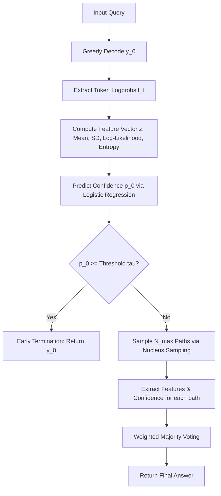

# Implementation Plan - Confidence-Aware Self-Consistency (CaSC)

  

This plan details the step-by-step implementation of the **Confidence-Aware Self-Consistency (CaSC)** framework using Hugging Face `transformers` and PyTorch on Apple Silicon (MPS).

  

To ensure a seamless, friction-free execution on an 8 GB M1 Mac, we will use **`Qwen/Qwen2.5-1.5B-Instruct`**. It is extremely lightweight (fitting easily in ~3 GB of memory), highly capable at math/reasoning tasks, and is **non-gated** (requires no Hugging Face API keys or approval to download).

  

---

  

## 1. System Requirements & Architecture

  

* **Hardware Acceleration:** PyTorch with Apple Silicon GPU acceleration (`device="mps"`).

* **Model:** `Qwen/Qwen2.5-1.5B-Instruct` (loaded in FP16 or BF16 to save memory).

* **Data Flow:**

  

  

---

  

## 2. Proposed Changes

  

We will create a clean, modular Python codebase under `/Users/hirthikbalaji/Documents/Papers/Research/casc_implementation/`:

  

### [NEW] `casc_framework.py`

This module will define the core `CaSC` decoding class. It will:

* Load the Hugging Face model and tokenizer on the `mps` device.

* Implement a `greedy_decode_with_logprobs` function to extract token-level generation probabilities.

* Implement a `sample_with_logprobs` function for nucleus sampling.

* Compute the 4 paper-defined features:

1. Mean token confidence: $\bar{c}$

2. Standard deviation of token confidence: $\sigma_c$

3. Length-normalized log-likelihood: $L_{\text{norm}}$

4. Entropy proxy: $H$

* Implement the logistic regression confidence classifier $\hat{p} = \sigma(\mathbf{w}^T \mathbf{z} + b)$.

* Implement the weighted majority voting aggregation.

  

### [NEW] `train_gate.py`

A script to train the lightweight logistic regression classifier on a small calibration dataset:

* Uses a set of ~50 math problems.

* Generates outputs and logs whether they are correct/incorrect against ground-truth.

* Saves the feature vectors $\mathbf{z}$ and labels $y \in \{0, 1\}$.

* Fits the weights $(\mathbf{w}, b)$ and saves them to a JSON configuration file.

  

### [NEW] `evaluate.py`

An evaluation suite that tests the framework against standard baselines on a subset of mathematical reasoning problems (e.g., GSM8K or synthetic arithmetic):

* Compares:

1. **Greedy CoT** ($N=1$)

2. **Standard Self-Consistency** ($N=5$) with uniform voting

3. **CaSC** (Ours) with adaptive early stopping and weighted voting

* Measures:

* **Accuracy** (%)

* **Average Sample Complexity** ($\bar{N}$)

* **Tokens / Compute Savings** (%)

* **Inference Speed / Latency**

  

---

  

## 3. Verification Plan

  

### Automated Verification

* Run a verification script `test_imports.py` to ensure PyTorch MPS and Transformers are fully active.

* Run a tiny dry-run with 3 math questions to verify that the early-termination gate triggers properly on high-confidence questions and falls back to sampling on low-confidence ones.

  

### Manual Verification

* Monitor the M1 memory usage via Activity Monitor during execution to confirm it stays well within the 8 GB budget.

* Review the generated logs showing the exact token confidence scores and features for a few sample generations.